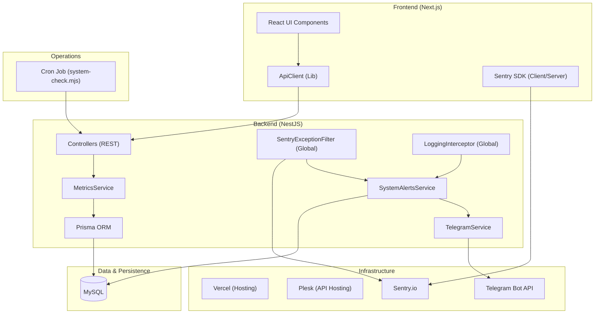

# HealthOS System Architecture

This document describes the high-level architecture of the HealthOS platform, with a focus on the observability, telemetry, and incident response layers implemented in Week 1.

## High-Level Overview

HealthOS is built on a modern decoupled architecture using Next.js for the frontend and NestJS for the backend, with Prisma as the ORM and MySQL as the database.

## Core Components

### 1. Observability Pipeline
- **Sentry Integration**: Captures all 5xx errors and performance traces. Enriched with `request_id`, `userId`, and `ip`.
- **Structured Logging**: `LoggingInterceptor` generates standard JSON logs for every HTTP request (scoping out binary/asset noise).
- **Global Filters**: `SentryExceptionFilter` catches unhandled exceptions and routes them to both Sentry and the `SystemAlertsService`.

### 2. Incident Response (Alerting)
- **SystemAlertsService**: Manages the lifecycle of system alerts. Categorizes events by `severity` (info, warn, critical) and `type`.
- **Deduplication**: Telegram notifications are deduplicated in-memory (2-minute window per type) to prevent notification storms.
- **TelegramService**: Immediate push notifications to team channels for `critical` alerts via Bot API.

### 3. Health & Telemetry
- **MetricsService**: Aggregates real-time health data (uptime, error rates in the last hour).
- **System Check Script**: A standalone `system-check.mjs` script runs via Cron to perform external polling of the `/health` and `/internal/health-check` endpoints.

## Operational Endpoints
- `GET /health`: Basic liveness probe (Public).
- `GET /ops/sentry-test`: Verification endpoint to trigger a Sentry event (Public).
- `GET /internal/health-check`: Deep diagnostics with metrics (Secret-protected via `X-INTERNAL-SECRET`).
- `GET /admin/alerts`: Management UI for historical alerts.
